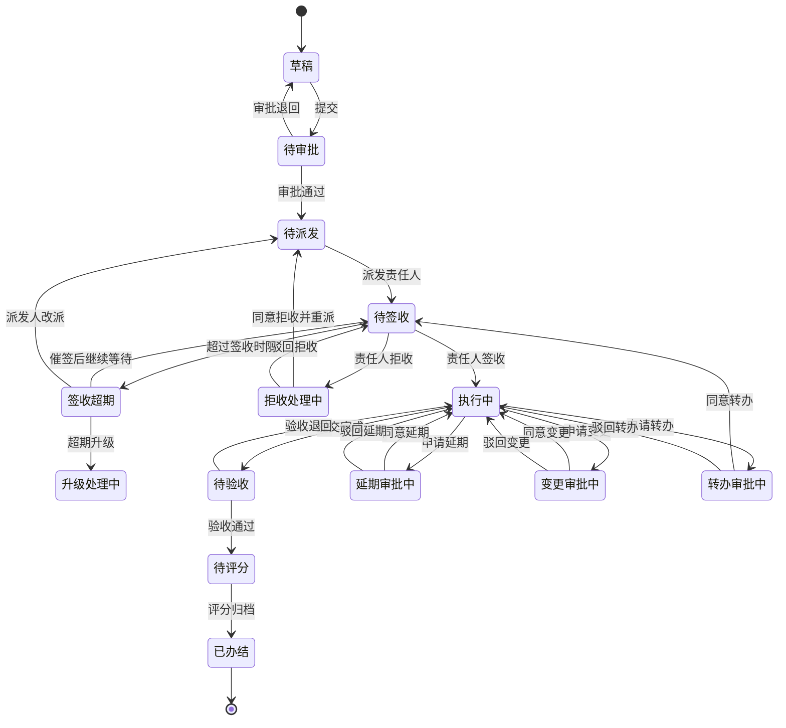
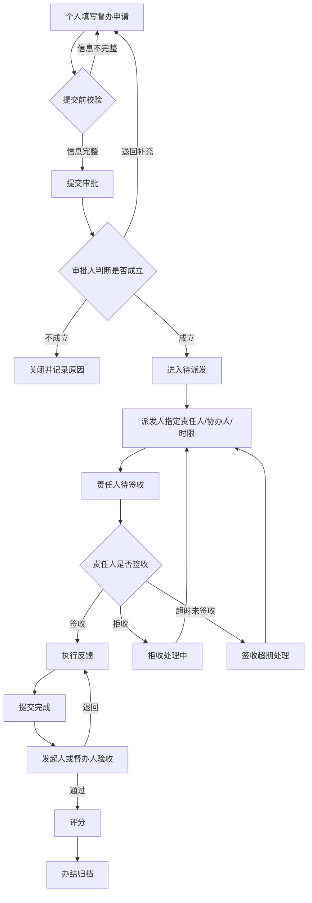
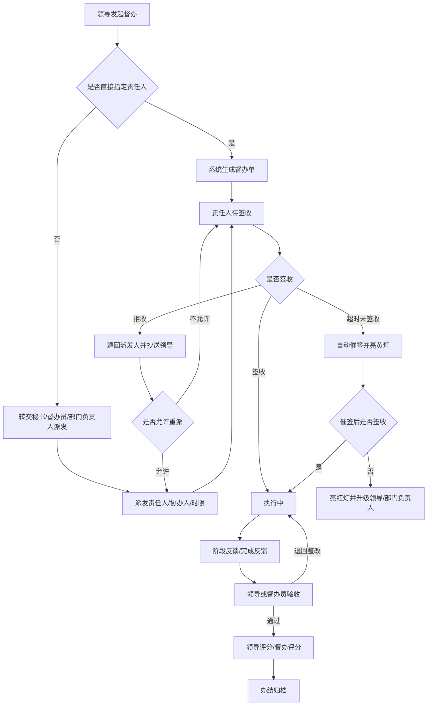
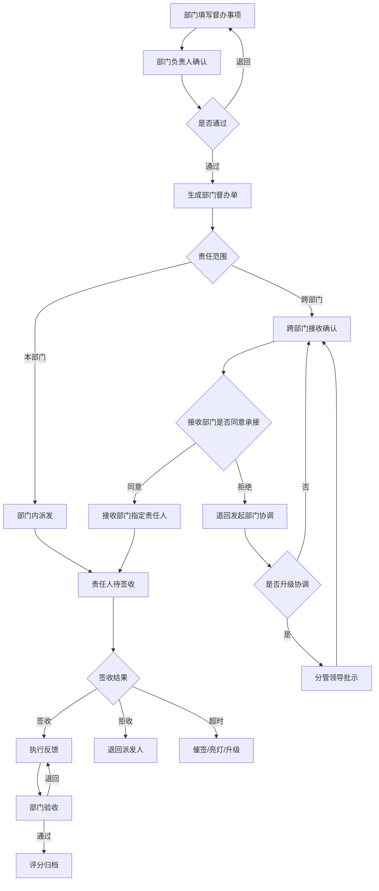
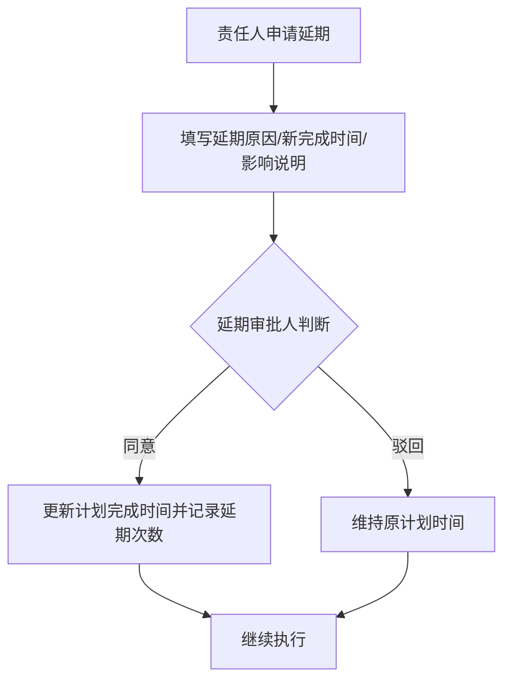
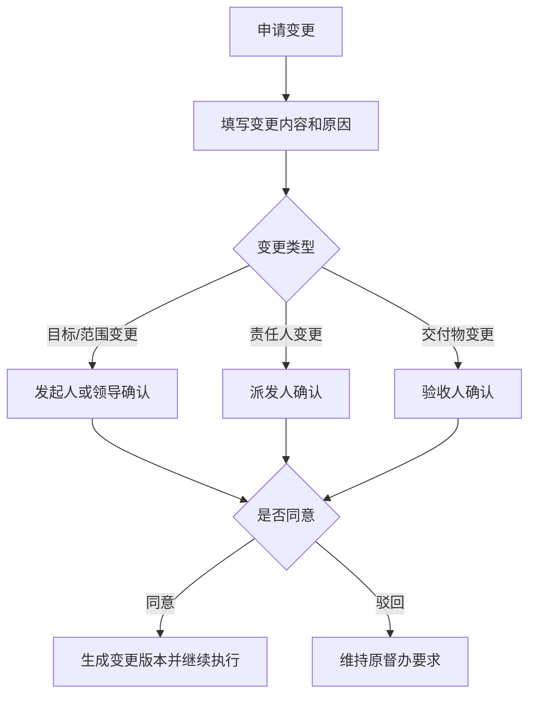

# 督办全流程设计

## 1. 设计目标

本流程覆盖三类督办发起场景：

- 个人发起督办的流转流程
- 领导发起督办并转交员工的流转流程
- 发起部门督办的流转流程

流程不以 OA 审批为核心，而以“事项必须闭环”为核心。系统需要确保每个督办事项从发起、审批、派发、签收、执行、反馈、验收、评分到归档均有责任人、时限、状态、异常处理和留痕。

## 2. 核心对象

### 2.1 督办单

| 字段 | 说明 |
| --- | --- |
| 督办编号 | 系统自动生成，唯一标识 |
| 督办标题 | 督办事项名称 |
| 督办来源 | 个人发起 / 领导发起 / 部门发起 / 会议纪要 / 重点事项 |
| 发起人 | 创建督办的人 |
| 发起部门 | 督办发起所属部门 |
| 审批人 | 对督办是否成立进行确认的人 |
| 派发人 | 将督办任务派给责任人的人 |
| 责任人 | 必须签收并执行的人 |
| 协办人 | 协助责任人完成事项的人 |
| 责任部门 | 责任人所属部门 |
| 督办等级 | 普通 / 重要 / 紧急 / 重大 |
| 计划开始时间 | 事项计划开始时间 |
| 计划完成时间 | 事项计划完成时间 |
| 当前节点 | 当前流程环节 |
| 当前状态 | 草稿 / 待审批 / 待派发 / 待签收 / 执行中 / 待验收 / 已办结等 |
| 亮灯状态 | 绿灯 / 黄灯 / 红灯 / 黑灯 |
| 是否延期 | 是否发生过延期 |
| 是否变更 | 是否发生过变更 |
| 是否转办 | 是否发生过转办 |
| 完成评分 | 办结后的评分 |
| 归档结论 | 完成 / 部分完成 / 取消 / 转项目 / 关闭 |

### 2.2 督办动作

| 动作 | 可操作角色 | 说明 |
| --- | --- | --- |
| 提交 | 发起人 | 提交督办申请，进入审批 |
| 审批通过 | 审批人 | 确认督办成立，进入派发 |
| 审批退回 | 审批人 | 退回发起人补充材料 |
| 派发 | 派发人 | 指定责任人、协办人、完成时限 |
| 签收 | 责任人 | 确认接收任务，进入执行 |
| 拒收 | 责任人 | 说明拒收原因，退回派发人处理 |
| 反馈 | 责任人 / 协办人 | 填写进展、上传附件 |
| 催办 | 发起人 / 督办人 / 领导 | 触发提醒并留痕 |
| 转办 | 派发人 / 责任人申请 | 更换责任人或责任部门 |
| 延期 | 责任人申请 | 申请调整完成时间 |
| 变更 | 发起人 / 派发人 / 责任人申请 | 调整事项内容、目标、范围或责任 |
| 批示 | 领导 | 对督办事项给出指示意见 |
| 验收 | 发起人 / 督办人 / 领导 | 确认完成情况 |
| 评分 | 验收人 / 领导 | 对完成质量、时效、协同进行评价 |
| 办结 | 督办人 / 系统 | 完成归档 |

## 3. 总体状态机

## 4. 三类发起流程

### 4.1 个人发起督办

适用场景：员工发现某事项需要跨部门跟进、事项长期未推动、个人负责事项需要正式督办。

个人发起必须有审批环节，避免个人随意将普通协作事项升级为正式督办。

### 4.2 领导发起督办转交员工

适用场景：领导直接提出重点事项、会议纪要事项、专项工作、临时指示。

领导发起可以跳过普通审批，但必须有签收、反馈、验收、评分和归档。拒收时不能直接结束，必须回到派发或领导确认。

### 4.3 发起部门督办

适用场景：部门对其他部门或本部门员工发起任务督办，例如项目推进、制度执行、专项整改。

部门督办要特别处理“跨部门承接确认”。跨部门拒绝不能直接关闭，应进入协调或领导批示。

## 5. 签收闭环规则

### 5.1 正常签收

| 步骤 | 规则 |
| --- | --- |
| 1 | 派发后进入待签收 |
| 2 | 系统通知责任人 |
| 3 | 责任人在签收时必须确认完成时限、交付物和责任范围 |
| 4 | 签收后状态变为执行中 |

### 5.2 超时未签收

| 时间点 | 系统动作 | 状态变化 |
| --- | --- | --- |
| 派发后 4 小时未签收 | 站内消息提醒责任人 | 待签收 |
| 派发后 8 小时未签收 | 抄送派发人，亮黄灯 | 签收预警 |
| 派发后 1 个工作日未签收 | 抄送责任人上级，亮红灯 | 签收超期 |
| 超期后仍未签收 | 派发人必须改派、强制签收或升级批示 | 升级处理中 |

签收超期不能一直停在待签收，系统必须要求派发人处理。

### 5.3 拒收

责任人拒收时必须填写：

- 拒收原因
- 是否非本人职责
- 建议责任部门或责任人
- 是否需要领导协调
- 附件或说明

拒收后的处理：

| 处理方式 | 结果 |
| --- | --- |
| 派发人同意拒收 | 回到待派发，重新派发 |
| 派发人驳回拒收 | 回到待签收，责任人必须签收 |
| 责任归属争议 | 进入领导批示 |
| 多次拒收 | 自动升级到部门负责人 |

## 6. 执行过程闭环规则

### 6.1 反馈

执行中必须支持多次反馈。

| 反馈类型 | 使用场景 |
| --- | --- |
| 进度反馈 | 说明当前完成百分比和下一步 |
| 卡点反馈 | 说明资源、权限、协作、资料等卡点 |
| 阶段反馈 | 长周期事项阶段性汇报 |
| 完成反馈 | 提交最终完成结果和附件 |

### 6.2 延期

延期不能只是改日期，必须审批或确认。

延期字段：

- 原计划完成时间
- 新申请完成时间
- 延期原因
- 影响范围
- 是否影响整体目标
- 审批意见
- 延期次数

### 6.3 变更

变更适用于目标、范围、责任人、交付物、完成标准发生变化。

所有变更必须保留版本记录，不能覆盖原内容。

### 6.4 转办

转办适用于责任人变化。

| 场景 | 处理规则 |
| --- | --- |
| 责任人主动申请转办 | 派发人审批 |
| 派发人直接转办 | 新责任人重新签收 |
| 跨部门转办 | 接收部门负责人确认 |
| 领导批示转办 | 直接进入新责任人待签收 |

转办后必须重新进入签收环节，不能直接进入执行中。

## 7. 催办、批示、亮灯

### 7.1 催办

催办可由系统自动触发，也可人工触发。

| 催办类型 | 触发条件 | 接收人 |
| --- | --- | --- |
| 签收催办 | 到签收时限未签收 | 责任人 |
| 进度催办 | 执行中长期无反馈 | 责任人 |
| 到期催办 | 距完成时间不足 24 小时 | 责任人、协办人 |
| 超期催办 | 超过计划完成时间 | 责任人、上级、派发人 |
| 验收催办 | 完成反馈后验收人未处理 | 验收人 |

催办必须留痕，包括催办人、催办时间、催办内容、接收人、是否已读。

### 7.2 批示

领导批示可以发生在：

- 发起后
- 拒收争议
- 转办争议
- 延期争议
- 超期升级
- 验收争议
- 重大事项办结前

批示后必须有承接动作：

| 批示内容 | 后续动作 |
| --- | --- |
| 明确责任人 | 派发或转办到指定责任人 |
| 要求限期完成 | 更新督办时限 |
| 要求补充材料 | 退回相关人补充 |
| 要求升级处理 | 进入升级处理中 |
| 同意关闭 | 进入办结归档 |

批示不能只是备注，必须推动状态变化或形成待办。

### 7.3 亮灯规则

| 灯色 | 条件 | 系统动作 |
| --- | --- | --- |
| 绿灯 | 未临期、正常反馈 | 正常展示 |
| 黄灯 | 距截止时间小于 20%，或签收/反馈即将超时 | 提醒责任人 |
| 红灯 | 已超期，或拒收/延期/转办未处理 | 抄送上级和督办人 |
| 黑灯 | 严重超期，或重大事项无人处理 | 升级领导批示 |

亮灯维度包括：

- 签收灯
- 进度灯
- 到期灯
- 验收灯
- 总体灯

总体灯取最严重状态。

## 8. 验收与评分

### 8.1 验收

责任人提交完成后，进入验收。

验收人可以：

- 验收通过
- 退回整改
- 要求补充附件
- 发起复核
- 提交领导确认

验收退回必须写明整改要求和整改时限。

### 8.2 评分

评分建议分 100 分。

| 评分项 | 分值 | 说明 |
| --- | --- | --- |
| 按时完成 | 30 | 是否按计划完成 |
| 完成质量 | 30 | 是否达到交付标准 |
| 反馈及时性 | 20 | 是否按要求反馈进展 |
| 协同配合 | 10 | 是否积极协同 |
| 材料完整性 | 10 | 附件、说明、过程记录是否完整 |

评分结果：

- 90-100：优秀
- 80-89：良好
- 60-79：合格
- 60 以下：不合格，进入复盘

## 9. 闭环控制清单

| 环节 | 必须闭环点 |
| --- | --- |
| 发起 | 信息不完整不能提交 |
| 审批 | 不通过必须说明原因 |
| 派发 | 必须指定责任人和完成时间 |
| 签收 | 不签收必须自动催签并升级 |
| 拒收 | 必须由派发人处理，不能悬空 |
| 执行 | 长期无反馈必须催办 |
| 延期 | 必须审批，不能私自改日期 |
| 变更 | 必须保留版本 |
| 转办 | 新责任人必须重新签收 |
| 批示 | 必须转成动作或待办 |
| 验收 | 退回必须写整改要求 |
| 评分 | 评分后才能办结 |
| 办结 | 必须形成归档记录 |

## 10. 推荐页面形态

### 10.1 督办工作台

- 我的待签收
- 我的执行中
- 我的待反馈
- 我的待验收
- 我发起的督办
- 我派发的督办
- 已超期督办
- 领导批示待处理

### 10.2 督办详情页

建议分区：

- 基本信息
- 责任信息
- 时限与亮灯
- 过程记录
- 反馈记录
- 变更/延期/转办记录
- 批示记录
- 验收与评分
- 操作按钮区

### 10.3 督办看板

- 督办总量
- 待签收数量
- 执行中数量
- 超期数量
- 拒收数量
- 延期数量
- 按部门统计
- 按责任人统计
- 按灯色统计
- 平均办结周期

