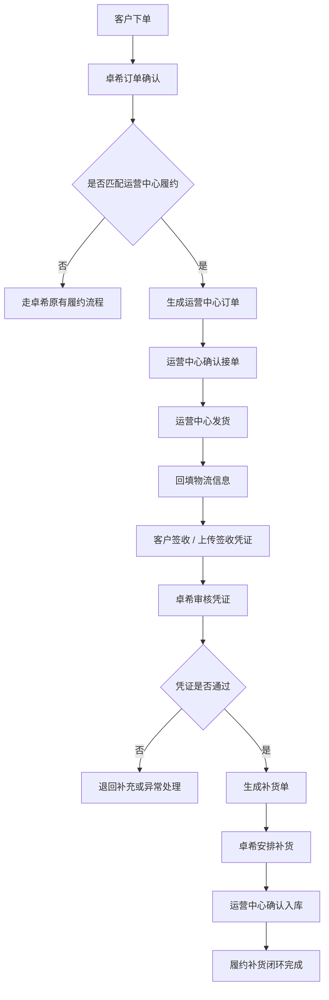

# 三方订单履约与补货功能梳理

## 一、需求背景

当前业务存在三方协同履约场景：

- 客户向卓希集团下单。
- 合作商具备现货库存，可以直接向客户发货。
- 卓希集团需要掌握合作商履约过程，并在合作商发货后为其生成补货单，保持合作商库存可持续周转。

因此，本需求不是单纯的订单查询，也不是单纯的补货申请，而是一个围绕 `客户订单 -> 合作商履约 -> 物流签收 -> 卓希补货` 的三方履约闭环。

## 二、核心定义

### 1. 卓希集团

平台方、货源方和补货方，负责客户订单承接、履约规则配置、合作商订单监控、签收凭证审核、补货单生成与补货推进。

### 2. 合作商 / 运营中心

具备一定库存和本地履约能力的合作伙伴。系统中建议统一命名为 `运营中心`，用于承接客户订单、完成发货、回填物流信息、上传签收凭证，并接收卓希补货。

### 3. 客户

实际下单和收货方。客户侧不需要感知复杂的三方协同，只需要看到订单状态、物流状态和正常售后入口。

### 4. 运营中心订单

由客户订单拆分或派生出的合作商履约任务。它用于记录某个客户订单由哪个运营中心发货、发货数量、物流信息、签收凭证和履约状态。

### 5. 签收凭证

证明客户已收到货物的材料，可包括物流签收记录截图、客户签收单照片、盖章单据、电子签收截图等。签收凭证是触发补货的重要依据。

### 6. 补货单

卓希集团向运营中心补充库存的业务单据。补货单应与原客户订单、运营中心订单、发货数量、签收凭证建立关联，避免补错、重补、漏补。

## 三、业务目标

### 1. 核心目标

- 让具备现货的合作商可以先行向客户发货，提升订单履约速度。
- 让卓希集团能够集中查看合作商订单、物流进度和签收凭证。
- 在合作商完成履约后，由卓希集团生成补货单，为合作商补回已消耗库存。
- 建立订单、物流、签收、补货之间的可追溯关系。

### 2. 业务价值

- 提升客户收货时效。
- 提升合作商参与履约的积极性。
- 降低总部直接履约压力。
- 让补货有据可依，减少人工对账和重复沟通。
- 支持后续运营中心库存、结算和服务质量评估。

## 四、角色与职责

| 角色 | 所属方 | 核心职责 | 关键操作 |
| --- | --- | --- | --- |
| 客户 | 客户侧 | 下单、收货、签收 | 查看订单和物流 |
| 运营中心人员 | 合作商 | 承接订单、发货、上传凭证 | 确认订单、填写物流、上传签收凭证 |
| 卓希订单运营 | 卓希集团 | 监控订单履约、处理异常 | 查看运营中心订单、催办、关闭异常 |
| 卓希供应链/仓配 | 卓希集团 | 生成并执行补货单 | 确认补货数量、安排补货发出 |
| 卓希审核人员 | 卓希集团 | 审核签收凭证和补货依据 | 审核凭证、确认补货触发 |
| 管理者 | 卓希集团 | 看整体履约效率和风险 | 查看看板、导出报表 |

## 五、核心业务流程

1. 客户下单并完成订单确认。
2. 系统判断订单商品、区域、库存和运营中心履约资格。
3. 若合作商有货且满足履约规则，生成运营中心订单。
4. 运营中心确认接单。
5. 运营中心备货并发货。
6. 运营中心回填物流公司、物流单号、发货时间。
7. 客户收货，物流状态变为已签收，或运营中心上传签收凭证。
8. 卓希审核签收凭证和履约数据。
9. 审核通过后，系统生成补货单草稿或正式补货单。
10. 卓希供应链确认补货数量、补货仓、发货方式。
11. 卓希向运营中心补货。
12. 运营中心确认补货入库，闭环完成。

## 六、业务流程图

## 七、核心对象设计

### 1. 客户订单

客户订单仍是原始业务单据，用于记录客户购买行为、付款状态、商品明细、收货地址和售后状态。

建议新增或关联字段：

- 履约方式：卓希发货 / 运营中心发货 / 混合履约
- 运营中心编号
- 运营中心订单编号
- 是否已生成补货单
- 补货单编号

### 2. 运营中心订单

运营中心订单是本需求的核心过程单据。

建议字段：

| 字段 | 说明 |
| --- | --- |
| 运营中心订单编号 | 系统生成，唯一标识 |
| 来源客户订单号 | 关联客户订单 |
| 运营中心 | 承接履约的合作商 |
| 客户信息 | 客户名称、收货人、地址、联系方式 |
| 商品明细 | SKU、名称、规格、数量 |
| 分配原因 | 区域匹配、库存充足、人工指定等 |
| 接单状态 | 待确认、已确认、拒绝接单 |
| 发货状态 | 待发货、已发货、部分发货 |
| 签收状态 | 待签收、已签收、异常签收 |
| 凭证状态 | 待上传、待审核、审核通过、审核驳回 |
| 补货状态 | 待生成、已生成、补货中、已完成 |
| 异常标记 | 缺货、超时、凭证异常、物流异常 |

### 3. 运营中心库存

用于判断运营中心是否可以承接客户订单。

V1 可先采用轻量方式：

- 若已有库存系统：读取可用库存。
- 若暂无实时库存：支持运营中心手动维护可发库存或由卓希运营导入。

建议字段：

- 运营中心
- SKU
- 可用库存
- 锁定库存
- 安全库存
- 最近更新时间
- 库存来源：系统同步 / 手工维护 / 导入

### 4. 物流记录

用于追踪运营中心发货过程。

建议字段：

- 物流公司
- 物流单号
- 发货时间
- 发货件数
- 发货图片
- 物流轨迹
- 签收时间
- 签收人
- 异常说明

### 5. 签收凭证

用于补货依据审核。

建议字段：

- 凭证类型：物流签收截图 / 客户签收单 / 图片 / 其他
- 凭证文件
- 上传人
- 上传时间
- 审核人
- 审核时间
- 审核结果
- 驳回原因

### 6. 补货单

用于卓希向运营中心补回已发出的商品。

建议字段：

| 字段 | 说明 |
| --- | --- |
| 补货单编号 | 系统生成 |
| 来源运营中心订单 | 一张或多张运营中心订单 |
| 运营中心 | 补货接收方 |
| 补货商品 | SKU、名称、规格、数量 |
| 补货原因 | 客户订单履约消耗 |
| 生成方式 | 自动生成 / 人工生成 |
| 生成依据 | 签收凭证、发货数量、审核结果 |
| 补货状态 | 待确认、待发货、在途、已入库、已关闭 |
| 异常状态 | 数量不一致、凭证缺失、重复补货 |

## 八、状态流转

### 1. 运营中心订单状态

| 状态 | 含义 | 可执行动作 |
| --- | --- | --- |
| 待确认 | 已分配给运营中心，等待接单 | 确认接单、拒绝接单、改派 |
| 待发货 | 运营中心已接单，尚未发货 | 填写物流、标记缺货、申请异常 |
| 已发货 | 已回填物流信息 | 查看物流、补传发货图片、更新异常 |
| 已签收 | 物流显示签收或人工确认签收 | 上传凭证、提交审核 |
| 凭证待审核 | 签收凭证已提交 | 审核通过、审核驳回 |
| 履约完成 | 凭证通过，履约闭环完成 | 生成补货单、查看关联单据 |
| 异常关闭 | 无法继续履约或人工关闭 | 查看原因、重新分配 |

### 2. 补货单状态

| 状态 | 含义 | 可执行动作 |
| --- | --- | --- |
| 待确认 | 系统已生成补货单草稿 | 调整数量、确认补货、关闭 |
| 待发货 | 卓希已确认补货，等待仓库发出 | 安排发货、填写物流 |
| 补货在途 | 已向运营中心发货 | 查看物流、处理异常 |
| 已入库 | 运营中心确认收到补货 | 完成闭环 |
| 已关闭 | 取消或异常终止 | 查看关闭原因 |

## 九、关键业务规则

### 1. 运营中心履约触发规则

客户订单满足以下条件时，才可进入运营中心履约：

- 订单状态已确认，且不存在付款、风控、售后等阻断。
- 商品支持运营中心履约。
- 客户收货区域匹配可服务的运营中心。
- 运营中心合作状态正常。
- 运营中心可用库存大于或等于订单所需数量。
- 商品批次、温层、保质期等关键约束满足发货要求。

### 2. 订单分配规则

建议支持三种分配方式：

| 分配方式 | 适用场景 |
| --- | --- |
| 系统自动分配 | 规则明确、库存可信、区域匹配明确 |
| 卓希人工指定 | 试运行阶段、重点客户、特殊订单 |
| 运营中心主动接单 | 后续扩展，用于多个运营中心抢单或认领 |

V1 建议采用 `系统推荐 + 卓希人工确认`，降低自动分配错误风险。

### 3. 发货规则

- 运营中心必须先确认接单，再填写物流。
- 支持整单发货和部分发货。
- 部分发货时，未发数量需要进入异常处理或重新分配。
- 发货后锁定对应运营中心库存消耗。
- 发货信息修改需保留日志。

### 4. 签收凭证规则

- 物流系统可识别已签收时，系统自动记录签收时间。
- 无法自动识别时，运营中心可手动上传签收凭证。
- 凭证审核通过后，才允许生成正式补货单。
- 凭证被驳回时，需要运营中心重新上传或由卓希人工处理。

### 5. 补货单生成规则

默认建议：

- `凭证审核通过` 后生成补货单。
- 补货数量以已签收且审核通过的实际发货数量为准。
- 若订单存在退货、拒收、少收，应按最终确认数量补货。
- 同一运营中心订单只能生成一次有效补货单。
- 若需要二次补货，必须通过人工创建补充补货单，并填写原因。

### 6. 异常规则

| 异常 | 处理方式 |
| --- | --- |
| 运营中心缺货 | 改派其他运营中心或回退卓希发货 |
| 超时未接单 | 自动提醒，超过阈值后卓希可改派 |
| 超时未发货 | 预警运营中心和卓希订单运营 |
| 物流异常 | 标记异常，暂停补货单生成 |
| 凭证缺失 | 不生成正式补货单，仅保留待处理状态 |
| 数量不一致 | 进入人工复核 |
| 重复补货风险 | 系统校验来源订单是否已有有效补货单 |

## 十、功能模块拆解

### 1. 卓希集团端

| 模块 | 功能点 | 说明 |
| --- | --- | --- |
| 运营中心订单看板 | 按状态查看订单 | 待确认、待发货、已发货、待审核、异常 |
| 运营中心订单详情 | 查看客户订单、商品、物流、凭证 | 作为三方履约主详情页 |
| 签收凭证审核 | 审核通过 / 驳回 | 支持填写驳回原因 |
| 补货单生成 | 自动生成草稿 / 手动生成 | 关联运营中心订单 |
| 补货单管理 | 确认、发货、在途、完成 | 面向供应链执行 |
| 异常处理 | 改派、关闭、退回、备注 | 保留处理日志 |
| 运营中心配置 | 区域、商品、库存、安全库存 | 控制可履约范围 |

### 2. 运营中心端

| 模块 | 功能点 | 说明 |
| --- | --- | --- |
| 待处理订单 | 查看分配给自己的订单 | 支持接单、拒绝 |
| 发货处理 | 填写物流、上传发货图片 | 支持部分发货 |
| 签收凭证 | 上传、重新上传凭证 | 查看审核结果 |
| 补货进度 | 查看卓希补货单状态 | 支持确认入库 |
| 库存维护 | 查看/维护可用库存 | V1 可手工维护 |

### 3. 客户端

V1 尽量不增加客户侧复杂感知。

客户侧只需保持：

- 正常订单状态展示。
- 正常物流展示。
- 售后入口不变。

是否展示“由运营中心发货”需要根据业务口径决定，默认不作为首版强展示内容。

## 十一、页面清单

| 页面 | 使用方 | 核心目标 |
| --- | --- | --- |
| 运营中心订单列表 | 卓希 | 集中管理合作商履约订单 |
| 运营中心订单详情 | 卓希 / 运营中心 | 查看订单、商品、物流、凭证、补货关联 |
| 签收凭证审核页 | 卓希 | 判断是否允许补货 |
| 补货单列表 | 卓希 | 管理待确认、待发货、在途、已完成补货单 |
| 补货单详情 | 卓希 / 运营中心 | 查看补货来源、商品、数量和物流 |
| 运营中心工作台 | 运营中心 | 处理待接单、待发货、待传凭证任务 |
| 运营中心库存维护 | 运营中心 / 卓希 | 维护可发库存和安全库存 |
| 运营中心配置页 | 卓希 | 维护合作商、服务区域、商品范围 |

## 十二、权限设计

| 功能 | 卓希订单运营 | 卓希供应链 | 卓希审核 | 运营中心 | 管理者 |
| --- | --- | --- | --- | --- | --- |
| 查看全部运营中心订单 | 可 | 可 | 可 | 不可 | 可 |
| 查看本运营中心订单 | 不适用 | 不适用 | 不适用 | 可 | 不适用 |
| 分配/改派订单 | 可 | 不可 | 不可 | 不可 | 可 |
| 确认接单 | 不可 | 不可 | 不可 | 可 | 不可 |
| 填写物流 | 可 | 不可 | 不可 | 可 | 不可 |
| 上传签收凭证 | 可 | 不可 | 不可 | 可 | 不可 |
| 审核签收凭证 | 不可 | 不可 | 可 | 不可 | 可 |
| 生成补货单 | 可 | 可 | 可审核触发 | 不可 | 可 |
| 确认补货发出 | 不可 | 可 | 不可 | 不可 | 可 |
| 确认补货入库 | 不可 | 可 | 不可 | 可 | 可 |

## 十三、MVP 范围建议

### V1 必做

- 运营中心订单生成和列表。
- 运营中心接单、发货、物流回填。
- 签收凭证上传和审核。
- 补货单生成、确认和状态跟踪。
- 订单与补货单关联追溯。
- 基础异常处理和操作日志。

### V1 可暂缓

- 多运营中心智能最优分配。
- 自动结算。
- 复杂库存批次管理。
- 客户侧运营中心品牌露出。
- 运营中心绩效评分。
- 与第三方物流的深度自动化轨迹同步。

### V2 扩展

- 自动按区域、库存、时效和服务评分分配运营中心。
- 运营中心库存预警和自动补货建议。
- 运营中心履约 SLA 看板。
- 补货与财务结算联动。
- 客户售后与运营中心责任判定。

## 十四、指标设计

| 指标 | 含义 |
| --- | --- |
| 运营中心履约订单占比 | 有多少客户订单由运营中心发货 |
| 平均发货时长 | 从订单分配到运营中心发货的时间 |
| 签收凭证及时率 | 签收后规定时间内上传凭证的比例 |
| 补货单生成及时率 | 凭证通过后规定时间内生成补货单的比例 |
| 补货完成时长 | 从补货单生成到运营中心确认入库的时间 |
| 异常订单率 | 缺货、物流异常、凭证异常等占比 |
| 重复补货/漏补货次数 | 补货准确性指标 |

## 十五、主要风险

| 风险 | 影响 | 建议 |
| --- | --- | --- |
| 运营中心库存不准确 | 订单分配后无法发货 | V1 采用人工确认接单，库存仅作为推荐依据 |
| 签收凭证真实性不足 | 可能导致错误补货 | 引入审核和凭证留痕 |
| 补货数量与实际发货不一致 | 造成库存和财务差异 | 补货以审核通过的实际签收数量为准 |
| 客户售后责任不清 | 出现争议时难追责 | 订单、物流、凭证、补货全链路留痕 |
| 运营中心操作不及时 | 客户体验下降 | 设定接单、发货、上传凭证时限和提醒 |

## 十六、待确认问题

1. 客户订单来源系统是什么，是否已经有订单拆分或履约分配能力？
2. 运营中心库存是否有系统数据源，还是需要先手工维护？
3. 补货单是进入现有采购/仓配系统，还是先在本系统内闭环？
4. 补货触发点采用 `物流签收` 还是 `凭证审核通过`？
5. 运营中心是否允许拒单，拒单后是否自动改派？
6. 客户是否需要看到“运营中心发货”的身份信息？
7. 补货是否涉及结算、价格、账期和对账？
8. 签收凭证的合规要求是什么，是否需要长期归档？

## 十七、验收标准

- 客户订单可以被分配给指定运营中心。
- 运营中心可以在系统内查看自己的待处理订单。
- 运营中心可以确认接单并回填物流信息。
- 系统可以记录发货、签收、凭证上传、凭证审核全过程。
- 卓希可以查看全部运营中心订单及其状态。
- 签收凭证审核通过后，可以生成关联补货单。
- 补货单可以追溯到来源客户订单和运营中心订单。
- 同一运营中心订单不会重复生成有效补货单。
- 异常订单可以被标记、备注、关闭或改派。
- 所有关键操作均有操作人和操作时间记录。
