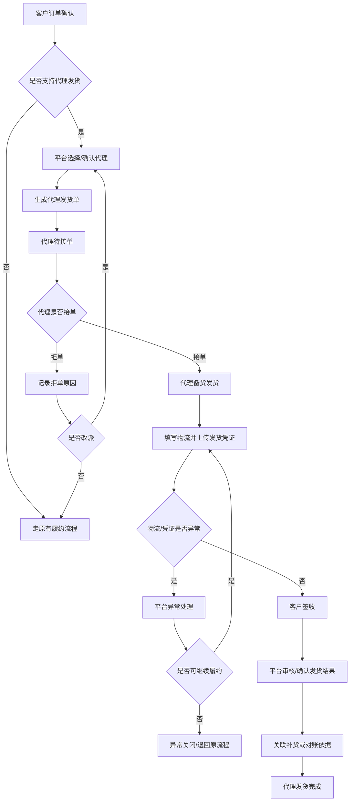

# 代理发货管理功能梳理

## 一、需求背景

现有三方履约补货方案已经覆盖 `客户订单 -> 运营中心履约 -> 物流签收 -> 卓希补货` 的主流程。业务侧提出的“代理发货管理”可以作为该履约体系下的独立管理模块，用于把客户订单分配给具备库存和发货能力的代理/运营中心，并让平台统一追踪接单、发货、物流、异常和后续补货依据。

本功能重点解决：

- 平台无法清晰知道哪些订单交给代理发货。
- 代理接单、拒单、发货和物流回填依赖线下沟通。
- 平台缺少代理发货进度、异常和责任人的集中看板。
- 发货数量、物流信息、凭证和补货/对账之间缺少强关联。

## 二、功能定位

`代理发货管理` 是订单履约体系中的过程管理能力。

它不替代客户订单，也不替代补货单，而是在客户订单和补货/结算之间新增一张过程单据：`代理发货单`。

```text
客户订单
  -> 代理发货单
    -> 接单记录
    -> 发货物流
    -> 发货凭证/签收凭证
    -> 异常记录
    -> 补货单/对账依据
```

## 三、术语定义

| 术语 | 说明 |
| --- | --- |
| 代理 | 具备区域服务、库存和发货能力的合作方。若系统内已统一命名为运营中心，则代理可作为业务口径展示。 |
| 代理发货单 | 平台把客户订单中的全部或部分商品交给代理发货后生成的过程单据。 |
| 派单 | 平台选择代理承接客户订单发货任务。 |
| 接单 | 代理确认可以按要求发货。 |
| 拒单 | 代理因缺货、区域、时效等原因无法承接。 |
| 发货凭证 | 代理发货时上传的打包、出库、面单或其他留痕材料。 |
| 签收凭证 | 证明客户已收到货物的物流签收记录、签收单或图片。 |

## 四、业务目标

- 让平台可集中管理代理承接的订单。
- 让代理在系统中完成接单、发货和凭证上传。
- 让平台及时发现拒单、超时、缺货、物流异常等风险。
- 让代理发货结果可以追溯到客户订单、商品明细、物流和补货/对账依据。
- 为后续代理履约质量、补货准确性和结算对账打基础。

## 五、角色与职责

| 角色 | 核心职责 | 关键操作 |
| --- | --- | --- |
| 平台订单运营 | 分配代理、监控发货进度、处理异常 | 派单、改派、催办、关闭异常 |
| 代理操作员 | 承接订单并完成发货 | 接单、拒单、填写物流、上传凭证 |
| 平台审核人员 | 审核发货/签收凭证 | 审核通过、驳回、标记异常 |
| 平台供应链 | 根据已完成发货生成补货或后续履约动作 | 查看依据、生成补货、确认发货 |
| 管理者 | 查看代理发货效率和异常 | 看板、导出、追踪指标 |

## 六、核心业务流程

1. 客户订单确认。
2. 平台判断订单是否支持代理发货。
3. 系统推荐可发货代理，或平台人工选择代理。
4. 平台生成代理发货单。
5. 代理收到待接单任务。
6. 代理确认接单或拒绝接单。
7. 代理备货并填写物流信息。
8. 代理上传发货凭证，可在签收后补充签收凭证。
9. 平台查看物流进度和凭证，必要时审核。
10. 订单签收且凭证通过后，代理发货单完成。
11. 系统关联补货单、对账单或后续处理单据。

## 七、流程图



## 八、核心数据对象

### 1. 代理发货单

| 字段 | 说明 |
| --- | --- |
| 代理发货单号 | 系统生成，唯一标识 |
| 来源客户订单号 | 关联客户订单 |
| 来源订单明细 | 关联被派给代理发货的商品行 |
| 代理名称 | 承接发货的代理/运营中心 |
| 客户信息 | 客户名称、收货人、手机号、收货地址 |
| 商品明细 | SKU、名称、规格、派单数量、实际发货数量 |
| 派单方式 | 系统推荐、平台人工指定、改派 |
| 派单人/时间 | 平台操作留痕 |
| 接单状态 | 待接单、已接单、已拒单、接单超时 |
| 发货状态 | 待发货、部分发货、已发货、发货超时 |
| 物流状态 | 待填写、运输中、已签收、物流异常 |
| 凭证状态 | 待上传、待审核、审核通过、审核驳回 |
| 完成状态 | 待处理、履约中、已完成、异常关闭 |
| 关联补货单 | 可为空，后续补货生成后回写 |

### 2. 代理基础资料

| 字段 | 说明 |
| --- | --- |
| 代理编号 | 唯一标识 |
| 代理名称 | 页面展示名称 |
| 合作状态 | 正常、暂停、终止 |
| 服务区域 | 可承接的省市区 |
| 可发商品 | 可承接发货的商品范围 |
| 联系人 | 代理操作负责人 |
| 发货仓/地址 | 代理默认发货地址 |
| 发货时效 | 承诺接单和发货时限 |

### 3. 发货物流记录

| 字段 | 说明 |
| --- | --- |
| 物流公司 | 必填 |
| 物流单号 | 必填 |
| 发货时间 | 必填 |
| 发货件数 | 必填 |
| 实际发货数量 | 按商品明细填写 |
| 发货图片 | 可选，支持图片或附件 |
| 修改记录 | 物流修改需留痕 |

### 4. 异常记录

| 字段 | 说明 |
| --- | --- |
| 异常类型 | 缺货、拒单、超时、物流异常、数量不一致、凭证异常 |
| 异常说明 | 具体原因 |
| 责任方 | 平台、代理、物流、客户、待确认 |
| 处理动作 | 改派、催办、关闭、继续履约 |
| 处理人/时间 | 操作留痕 |

## 九、状态流转

### 1. 主状态

| 状态 | 含义 | 可执行动作 |
| --- | --- | --- |
| 待派单 | 客户订单可代理发货，但尚未选择代理 | 派单、走原流程 |
| 待接单 | 已生成代理发货单，等待代理确认 | 接单、拒单、催办、改派 |
| 待发货 | 代理已接单，尚未填写物流 | 填写物流、标记缺货、申请异常 |
| 已发货 | 已提交物流和发货信息 | 查看物流、补传凭证、标记异常 |
| 已签收 | 物流或人工确认客户签收 | 上传/审核签收凭证 |
| 已完成 | 发货结果确认完成，可进入补货或对账 | 查看关联单据 |
| 异常关闭 | 无法继续代理发货 | 查看原因、重新派单或回退原流程 |

### 2. 拒单与改派

- 代理拒单必须选择原因并填写说明。
- 拒单后代理发货单进入 `已拒单/待平台处理`。
- 平台可改派其他代理，改派后生成新的代理发货单或复用原单并记录改派次数。
- V1 建议复用原单并保留改派日志，降低单据复杂度。

### 3. 部分发货

- 支持代理只发出部分商品或部分数量。
- 部分发货必须填写未发原因。
- 未发部分可改派其他代理、退回总部发货或关闭。
- 补货/对账只能按实际确认发货数量计算。

## 十、关键业务规则

### 1. 派单规则

- 客户订单状态必须已确认，且不存在付款、风控、售后阻断。
- 商品必须允许代理发货。
- 客户收货区域需匹配代理服务区域。
- 代理合作状态必须正常。
- 若有库存数据，可用库存应大于等于派单数量。
- V1 建议采用 `系统推荐 + 平台人工确认`。

### 2. 接单规则

- 代理只能查看和操作自己名下的发货单。
- 代理接单后才能填写物流。
- 代理拒单必须选择原因：库存不足、不在服务范围、无法按时发货、商品异常、其他。
- 超过接单时限未处理时，系统标记接单超时并提醒平台。

### 3. 发货规则

- 物流公司、物流单号、发货时间、发货件数为必填。
- 实际发货数量不能超过派单数量。
- 支持整单发货和部分发货。
- 物流信息修改必须保留修改前后内容、操作人和时间。
- 发货后订单进入物流跟踪或人工确认签收阶段。

### 4. 凭证规则

- 发货凭证可在发货时上传。
- 签收凭证可在物流签收后上传或由平台人工确认。
- 凭证被驳回后，代理可重新上传。
- 凭证通过后可作为补货或对账依据。

### 5. 防重规则

- 同一客户订单明细不能重复派给多个代理发同一数量。
- 同一代理发货单不能重复生成有效补货依据。
- 改派时必须释放或关闭原代理发货任务。

## 十一、功能模块拆解

### 1. 平台端

| 模块 | 功能点 | 说明 |
| --- | --- | --- |
| 代理发货订单列表 | 筛选、统计、查看、催办、导出 | 平台主工作台 |
| 代理发货订单详情 | 客户订单、代理、商品、物流、凭证、日志 | 核心详情页 |
| 派单/改派 | 选择代理、确认派单、记录原因 | 支持系统推荐 |
| 异常处理 | 标记异常、改派、关闭、备注 | 保留处理日志 |
| 凭证审核 | 审核通过、驳回、标记异常 | 可复用签收凭证审核能力 |
| 代理配置 | 服务区域、商品范围、联系人、时效 | 可复用运营中心配置 |

### 2. 代理端

| 模块 | 功能点 | 说明 |
| --- | --- | --- |
| 待处理工作台 | 待接单、待发货、凭证驳回、异常 | 代理进入系统后的首页 |
| 代理发货单详情 | 查看客户、商品、物流、凭证 | 单据处理页 |
| 接单/拒单 | 确认接单、拒绝接单 | 拒单必须填原因 |
| 填写物流 | 发货数量、物流公司、单号、发货时间 | 支持部分发货 |
| 上传凭证 | 发货图片、签收凭证 | 支持驳回后重传 |

## 十二、页面清单

| 页面 | 使用方 | 核心目标 |
| --- | --- | --- |
| 代理发货订单列表 | 平台 | 集中查看代理发货进度和待处理事项 |
| 代理发货订单详情 | 平台/代理 | 查看完整发货链路并执行操作 |
| 派单/改派弹窗 | 平台 | 选择代理并记录派单原因 |
| 异常处理抽屉 | 平台 | 处理缺货、拒单、超时、物流异常 |
| 代理发货工作台 | 代理 | 快速处理自己的待接单、待发货任务 |
| 物流填写弹窗 | 代理 | 提交发货物流和数量 |
| 凭证上传/审核页 | 平台/代理 | 上传、查看、审核凭证 |

## 十三、权限设计

| 功能 | 平台订单运营 | 平台审核 | 平台供应链 | 代理 | 管理者 |
| --- | --- | --- | --- | --- | --- |
| 查看全部代理发货单 | 可 | 可 | 可 | 不可 | 可 |
| 查看本代理发货单 | 不适用 | 不适用 | 不适用 | 可 | 不适用 |
| 派单/改派 | 可 | 不可 | 不可 | 不可 | 可 |
| 接单/拒单 | 不可 | 不可 | 不可 | 可 | 不可 |
| 填写物流 | 可代操作 | 不可 | 不可 | 可 | 可代操作 |
| 上传凭证 | 可代操作 | 不可 | 不可 | 可 | 可代操作 |
| 审核凭证 | 不可 | 可 | 不可 | 不可 | 可 |
| 异常关闭 | 可 | 不可 | 不可 | 不可 | 可 |
| 导出报表 | 可 | 可查看 | 可 | 不可 | 可 |

## 十四、MVP 范围建议

### V1 必做

- 代理发货单生成、列表、详情。
- 平台派单、改派、催办、异常关闭。
- 代理接单、拒单、填写物流、上传发货凭证。
- 状态流转、操作日志和权限控制。
- 与客户订单、补货单建立关联字段。

### V1 可暂缓

- 自动最优代理分配。
- 实时物流轨迹自动同步。
- 自动结算和对账单生成。
- 复杂批次、效期、温层校验。
- 代理履约评分。

### V2 扩展

- 按区域、库存、时效和履约评分自动推荐代理。
- 接单/发货 SLA 自动预警。
- 代理库存预占和自动扣减。
- 补货、结算、售后责任联动。
- 移动端扫码填物流和拍照上传凭证。

## 十五、指标设计

| 指标 | 含义 |
| --- | --- |
| 代理发货订单占比 | 客户订单中由代理发货的比例 |
| 平均接单时长 | 派单到代理确认接单的时间 |
| 平均发货时长 | 接单到发货的时间 |
| 拒单率 | 代理拒绝承接的比例 |
| 发货超时率 | 超过承诺时限仍未发货的比例 |
| 物流异常率 | 发货后出现物流异常的比例 |
| 凭证一次通过率 | 首次上传凭证审核通过的比例 |
| 补货/对账关联完整率 | 发货单关联后续单据的完整度 |

## 十六、主要风险

| 风险 | 影响 | 建议 |
| --- | --- | --- |
| 代理库存不准 | 派单后拒单或无法发货 | V1 先人工确认接单，库存作为推荐依据 |
| 代理操作不及时 | 客户收货时效下降 | 设置接单、发货时限和催办 |
| 发货数量不一致 | 影响补货和对账 | 按实际确认发货数量进入后续流程 |
| 物流信息填写错误 | 客户无法追踪物流 | 物流修改留痕，支持平台复核 |
| 责任边界不清 | 售后和异常难处理 | 单据、凭证、日志全链路留痕 |

## 十七、待确认问题

1. 页面最终命名使用 `代理发货` 还是统一使用 `运营中心发货`？
2. 代理库存是否有系统数据源，还是 V1 由代理手工维护？
3. 客户订单是否允许拆分给多个代理发货？
4. 代理发货完成后是否一定触发补货，还是可能只进入对账？
5. 客户侧是否展示代理发货方信息？
6. 物流轨迹是否接入第三方接口，还是 V1 先人工填写？
7. 代理拒单后是否自动改派，还是平台人工处理？

## 十八、验收标准

- 平台可以从客户订单生成代理发货单。
- 平台可以选择代理并完成派单。
- 代理只能看到并处理自己名下的发货单。
- 代理可以接单、拒单、填写物流、上传凭证。
- 拒单、部分发货、物流异常等情况可以进入异常处理。
- 发货数量不能超过派单数量。
- 物流信息修改有操作日志。
- 代理发货单可以追溯到客户订单、商品明细、物流、凭证和后续补货/对账单据。
- 页面可以按状态、代理、客户、商品和时间筛选。
- 所有关键动作记录操作人和操作时间。
