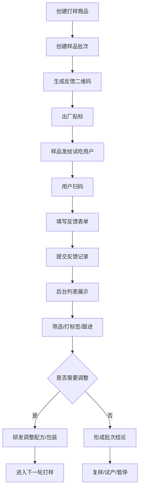

# 打样商品二维码反馈功能梳理

## 一、需求背景

卓希食品主营无骨鸡爪等休闲卤味产品。新品打样出厂后，需要把样品发给内部试吃人员、经销商、门店、渠道客户或目标消费者试吃。当前反馈通常通过微信、表格、口头沟通收集，存在以下问题：

- 反馈分散，难以按商品、批次、口味、渠道集中查看。
- 反馈内容不标准，研发和产品团队难以比较不同样品表现。
- 样品出厂、二维码、反馈记录之间缺少明确关联。
- 反馈处理状态不清楚，后续是否采纳、是否进入复盘不可追踪。

本功能通过在打样商品外包装贴二维码，让试吃用户扫码提交反馈，后台按商品和样品批次列表展示、统计和跟进。

## 二、功能定位

`打样商品二维码反馈` 是新品研发和样品试吃阶段的反馈收集工具。

它的核心不是营销活动，也不是正式售后评价，而是为研发、产品、销售和渠道团队提供一套结构化、可追溯的打样反馈闭环。

```text
打样商品
  -> 样品批次
    -> 反馈二维码
      -> 用户扫码评定
        -> 评定列表/详情
        -> 认可率/结论统计
        -> 研发调整/产品决策
```

## 三、核心定义

| 概念 | 说明 |
| --- | --- |
| 打样商品 | 尚未正式量产或上市的新口味、新规格、新包装商品。 |
| 样品批次 | 某次打样生产记录，用于区分生产日期、配方版本、包装版本、渠道投放范围。 |
| 反馈二维码 | 贴在样品包装上的二维码，用户扫码进入反馈表单。 |
| 反馈表单 | 用户按《样品品尝评定表》提交感官、口味、综合评定和最终结论的移动端页面。 |
| 反馈记录 | 用户提交后生成的后台数据记录。 |
| 优化建议 | 用户针对感官和口味填写的改进意见。 |

## 四、业务目标

- 让每个打样商品批次都有明确的反馈入口。
- 让用户扫码后按样品品尝评定表完成标准化评定。
- 让后台可以按商品、批次、评定维度、认可状态和最终结论查看反馈。
- 让研发团队快速识别新品是否需要调整配方、口感、包装或定价。
- 让销售和渠道团队判断样品是否具备进一步推广价值。

## 五、用户与角色

| 角色 | 核心诉求 | 关键操作 |
| --- | --- | --- |
| 试吃用户 | 快速反馈真实感受 | 扫码、勾选认可/不认可、填写优化建议、提交 |
| 产品/研发人员 | 查看口味、口感、问题和调整建议 | 看统计、筛选反馈、标记问题 |
| 销售/渠道人员 | 判断渠道客户接受度 | 查看客户反馈、导出结果 |
| 品控人员 | 关注批次异常和食品安全风险 | 查看批次反馈、标记风险 |
| 管理者 | 看新品打样整体表现 | 查看看板、认可率、最终结论分布 |

## 六、业务流程

1. 产品或研发创建打样商品。
2. 创建样品批次，填写配方版本、生产日期、计划投放对象。
3. 系统生成反馈二维码。
4. 工厂出厂贴标，二维码随样品发出。
5. 用户扫码进入移动反馈表单。
6. 用户查看商品信息并提交反馈。
7. 后台生成反馈记录。
8. 研发/产品按列表查看和筛选反馈。
9. 对重点反馈打标签、跟进、标记采纳或无效。
10. 形成样品批次结论：继续优化、进入复样、小批量试产、暂停。

## 七、流程图



## 八、核心对象设计

### 1. 打样商品

| 字段 | 说明 |
| --- | --- |
| 商品编号 | 系统生成或沿用商品标准库编号 |
| 商品名称 | 如藤椒无骨鸡爪、柠檬酸辣无骨鸡爪 |
| 商品分类 | 无骨鸡爪、虎皮凤爪、鸭掌等 |
| 口味方向 | 藤椒、酸辣柠檬、蒜香、泡椒、麻辣等 |
| 规格 | 克重、包装形式、箱规 |
| 研发负责人 | 负责该打样商品的研发人员 |
| 产品负责人 | 负责商品定义和反馈跟进 |
| 当前阶段 | 打样中、复样中、小批量试产、暂停、已转正 |

### 2. 样品批次

| 字段 | 说明 |
| --- | --- |
| 批次编号 | 如 SP20260513001 |
| 关联打样商品 | 关联商品编号 |
| 配方版本 | 如 V0.3、V1.0 |
| 包装版本 | 如手贴标签版、彩袋测试版 |
| 生产日期 | 样品生产日期 |
| 保质期/效期 | 样品有效期 |
| 生产工厂 | 生产或打样地点 |
| 投放对象 | 内部试吃、经销商、门店、消费者 |
| 投放数量 | 本批样品数量 |
| 邮寄次数 | 该样品批次对外邮寄或寄样的累计次数 |
| 二维码状态 | 未生成、已生成、已启用、已停用 |
| 批次结论 | 待观察、继续优化、进入复样、小批量试产、暂停 |

### 3. 反馈二维码

| 字段 | 说明 |
| --- | --- |
| 二维码编号 | 系统生成 |
| 关联批次 | 绑定样品批次 |
| 二维码链接 | 用户扫码访问的表单链接 |
| 生成方式 | 按批次生成、按单件生成 |
| 启用状态 | 未启用、已启用、已停用 |
| 有效期 | 超过后不再收集反馈 |
| 扫码次数 | 用户打开次数 |
| 提交次数 | 有效反馈数量 |

V1 建议采用 `一批次一个二维码`。如果后续需要追踪每一包样品，可扩展为 `一物一码`。

### 4. 反馈记录

| 字段 | 说明 |
| --- | --- |
| 反馈编号 | 系统生成 |
| 关联商品 | 从二维码批次带出 |
| 关联批次 | 从二维码批次带出 |
| 产品名称 | 从样品批次带出，允许后台配置 |
| 制样日期 | 从样品批次带出 |
| 评定日期 | 默认扫码当天，用户可确认 |
| 感官评定 | 认可 / 不认可 |
| 感官优化建议 | 感官不认可时建议必填，认可时可选填 |
| 口味评定 | 认可 / 不认可 |
| 口味优化建议 | 口味不认可时建议必填，认可时可选填 |
| 综合评定 | 认可 / 不认可 |
| 最终结论 | 直接推进 / 优化后再评 / 放弃开发 |
| 评定人 | 可选 |
| 联系方式 | 可选 |
| 图片附件 | 可选 |
| 提交时间 | 系统记录 |
| 处理状态 | 未读、已读、跟进中、已采纳、无效 |
| 后台标签 | 研发/产品人员后续打标 |

## 九、反馈表单设计

### 1. 表单结构

移动端扫码表单建议分为 4 段：

1. 基础信息：产品名称、制样日期、评定日期。
2. 评测维度：感官认可/不认可、感官优化建议。
3. 评测维度：口味认可/不认可、口味优化建议。
4. 综合评定：认可/不认可。
5. 最终结论：直接推进、优化后再评、放弃开发。
6. 补充信息：评定人、联系方式、图片附件。

### 2. 必填项建议

V1 必填：

- 产品名称
- 制样日期
- 评定日期
- 感官评定
- 口味评定
- 综合评定
- 最终结论
- 当感官或口味选择“不认可”时，对应优化建议必填

V1 非必填：

- 评定人
- 联系方式
- 图片
- 所在地区

### 3. 用户体验要求

- 表单控制在 1 到 2 分钟内完成。
- 认可/不认可使用清晰的大按钮，不使用复杂表格。
- 最终结论使用单选按钮，默认不预选，避免误提交。
- 提交后展示感谢页和反馈编号。
- 已停用或过期二维码显示“该样品反馈已结束”。

## 十、后台页面设计

### 1. 打样商品列表

用于管理新品打样对象。

字段建议：

- 商品编号
- 商品名称
- 口味方向
- 当前阶段
- 负责人
- 最新批次
- 反馈数量
- 认可率
- 操作：查看、创建批次、生成二维码

### 2. 样品批次列表

用于管理二维码和批次反馈。

字段建议：

- 批次编号
- 商品名称
- 配方版本
- 生产日期
- 投放对象
- 投放数量
- 邮寄次数
- 二维码状态
- 扫码次数
- 反馈数量
- 认可率
- 批次结论
- 操作：二维码、查看反馈、导出

### 3. 反馈列表

用于集中展示用户反馈。

筛选项：

- 商品
- 批次
- 用户类型
- 感官评定
- 口味评定
- 综合评定
- 最终结论
- 处理状态
- 提交时间

表格字段：

- 反馈编号
- 商品/批次
- 用户类型
- 感官/口味/综合评定结果
- 最终结论
- 优化建议摘要
- 文字摘要
- 提交时间
- 处理状态
- 操作：详情、打标、跟进

### 4. 反馈详情

用于查看单条反馈和处理记录。

展示内容：

- 商品和批次信息
- 用户基本信息
- 感官评定和优化建议
- 口味评定和优化建议
- 综合评定
- 最终结论
- 图片附件
- 后台标签
- 处理记录

操作：

- 标记已读
- 添加后台标签
- 设为跟进中
- 标记已采纳
- 标记无效
- 添加处理备注

### 5. 统计看板

建议 V1 做轻量统计：

- 反馈总数
- 感官认可率
- 口味认可率
- 综合认可率
- 最终结论分布
- 不认可反馈数量

## 十一、状态设计

### 1. 样品批次状态

| 状态 | 含义 | 可执行动作 |
| --- | --- | --- |
| 待生成二维码 | 已创建批次，未生成反馈入口 | 生成二维码 |
| 收集中 | 二维码已启用，正在收集反馈 | 查看反馈、停用二维码 |
| 已停用 | 不再收集反馈 | 查看历史反馈、重新启用 |
| 已复盘 | 已形成批次结论 | 查看结论、导出 |

### 2. 反馈处理状态

| 状态 | 含义 | 可执行动作 |
| --- | --- | --- |
| 未读 | 后台尚未查看 | 查看详情、标记已读 |
| 已读 | 已查看，未处理 | 打标签、跟进 |
| 跟进中 | 需要研发/产品处理 | 添加备注、采纳、关闭 |
| 已采纳 | 反馈已进入优化建议 | 查看采纳说明 |
| 无效 | 垃圾、重复或无参考价值 | 查看原因 |

## 十二、权限设计

| 功能 | 产品 | 研发 | 品控 | 销售/渠道 | 管理者 |
| --- | --- | --- | --- | --- | --- |
| 创建打样商品 | 可 | 可 | 不可 | 不可 | 可 |
| 创建样品批次 | 可 | 可 | 可查看 | 不可 | 可 |
| 生成二维码 | 可 | 可 | 不可 | 不可 | 可 |
| 查看反馈列表 | 可 | 可 | 可 | 可按权限查看 | 可 |
| 处理反馈 | 可 | 可 | 可处理风险类 | 不可 | 可 |
| 导出反馈 | 可 | 可 | 可 | 可按权限导出 | 可 |
| 形成批次结论 | 可 | 可参与 | 可参与 | 可参与 | 可 |

## 十三、MVP 范围

### V1 必做

- 打样商品管理。
- 样品批次管理。
- 批次二维码生成和启停。
- 用户扫码反馈移动表单。
- 反馈列表、筛选、详情。
- 反馈处理状态和后台标签。
- 基础统计和导出。

### V1 可暂缓

- 一物一码。
- 微信授权登录。
- 自动情感分析。
- 多语言反馈表单。
- 与生产系统自动同步批次。
- 与 CRM 自动关联客户。

### V2 扩展

- 一物一码追踪每包样品反馈。
- 反馈关键词自动聚类。
- 样品批次认可率趋势。
- 研发优化任务自动生成。
- 与商品标准库联动转正。
- 经销商客户分层分析。

## 十四、关键规则

- 二维码必须绑定样品批次，不能只绑定商品，否则无法区分配方版本。
- 反馈提交后不允许用户直接修改，避免数据被覆盖；如需补充可再次提交。
- 同一设备短时间重复提交需要提示，后台可标记疑似重复。
- 二维码停用后只展示结束页，不再允许提交。
- 批次结论形成后，仍可查看历史反馈，但默认不再新增反馈。
- 联系方式必须作为可选项，页面需提示仅用于反馈跟进。

## 十五、指标设计

| 指标 | 含义 |
| --- | --- |
| 扫码率 | 扫码次数 / 投放数量 |
| 反馈率 | 有效反馈数 / 投放数量 |
| 单次邮寄反馈数 | 有效反馈数 / 邮寄次数 |
| 感官认可率 | 感官选择认可的反馈占比 |
| 口味认可率 | 口味选择认可的反馈占比 |
| 综合认可率 | 综合评定选择认可的反馈占比 |
| 直接推进占比 | 最终结论为直接推进的反馈占比 |
| 优化后再评占比 | 最终结论为优化后再评的反馈占比 |
| 采纳率 | 已采纳反馈 / 有效反馈 |

## 十六、主要风险

| 风险 | 影响 | 建议 |
| --- | --- | --- |
| 二维码未区分批次 | 无法判断是哪版配方问题 | V1 强制二维码绑定样品批次 |
| 表单过长 | 用户不愿填写 | 控制在 1 到 2 分钟完成 |
| 反馈太主观 | 难以指导研发 | 按样品品尝评定表固定感官、口味、综合评定和最终结论 |
| 重复提交 | 影响统计准确性 | 记录设备、时间和重复提示 |
| 联系方式涉及隐私 | 合规风险 | 设为选填并提示用途 |

## 十七、待确认问题

1. 二维码由系统生成后给工厂下载打印，还是对接现有标签打印流程？
2. V1 是否只按批次生成二维码，是否需要一物一码？
3. 扫码反馈是否需要绑定微信/手机号，还是匿名即可？
4. 样品反馈是否面向消费者，还是只面向内部和渠道客户？
5. 是否允许上传图片或视频？
6. 反馈导出格式是否需要固定模板？
7. 样品批次是否需要关联现有商品标准库或研发配方系统？

## 十八、验收标准

- 后台可以创建打样商品和样品批次。
- 样品批次可以生成并启用二维码。
- 用户扫码后可以看到对应商品和批次信息。
- 用户可以提交感官、口味、综合评定、最终结论和优化建议。
- 后台反馈列表可以按商品、批次、评定结果、最终结论、状态筛选。
- 反馈详情可以查看完整反馈内容并处理状态。
- 后台可以查看批次维度的认可率、反馈数和最终结论分布。
- 二维码停用或过期后不能继续提交反馈。
- 反馈数据可以导出。
