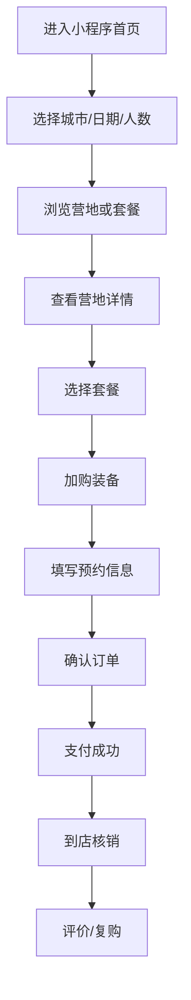

# 野餐露营小程序功能梳理

## 一、需求背景

面向城市周边休闲用户，野餐露营服务需要把营地浏览、套餐选择、装备租赁、档期预约、支付下单、到店核销和订单售后整合到一个轻量入口。用户通常在周末、节假日前临时决策，关注营地环境、交通距离、可预约时间、适合人数、餐食和装备是否齐全。

本小程序定位为 `野餐露营预约与装备租赁平台`，先完成 C 端用户从发现营地到预约下单的主链路。

## 二、核心用户

| 用户 | 核心诉求 | 关键操作 |
| --- | --- | --- |
| 亲子家庭 | 找安全、设施完整、可拍照的营地 | 浏览营地、选择亲子套餐、预约时段 |
| 朋友聚会 | 快速订多人野餐露营套餐 | 选择人数、加购装备、分摊费用 |
| 情侣约会 | 找氛围好、可布置的场景 | 查看场景图、选择精致套餐 |
| 运营人员 | 管理营地、套餐、库存和订单 | 上架营地、维护档期、处理订单 |

## 三、业务目标

- 提供清晰的营地发现和筛选入口。
- 让用户可以按日期、人数、套餐和装备完成预约。
- 降低用户准备成本，支持餐食、天幕、桌椅、炉具等一站式租赁。
- 支持订单状态跟踪、到店核销、退款和客服沟通。
- 为后续运营后台、商户端和会员体系预留扩展。

## 四、核心流程

## 五、功能模块

### 1. 首页

| 功能 | 说明 |
| --- | --- |
| 城市与日期 | 默认展示当前城市，可切换日期 |
| 搜索 | 支持营地名、区域、场景关键词 |
| 快捷分类 | 营地预约、套餐、装备租赁、活动 |
| 推荐营地 | 展示评分、距离、价格、人群标签 |
| 今日可约 | 优先展示仍有库存的营地和套餐 |

### 2. 营地列表与详情

| 功能 | 说明 |
| --- | --- |
| 筛选 | 距离、价格、人数、设施、可预约 |
| 营地卡片 | 封面、名称、距离、评分、价格、标签 |
| 详情页 | 场景、位置、开放时间、设施、注意事项 |
| 档期 | 展示可预约日期和时段 |
| 套餐入口 | 可选择推荐套餐或自定义搭配 |

### 3. 套餐与装备

| 功能 | 说明 |
| --- | --- |
| 套餐分类 | 双人、亲子、多人、生日布置、夜营 |
| 套餐内容 | 餐食、桌椅、天幕、灯串、地垫等 |
| 装备租赁 | 天幕、折叠椅、炉具、保温箱、投影等 |
| 库存校验 | 按日期和时段校验装备是否可租 |
| 加购 | 预约单中可加购装备和服务 |

### 4. 预约下单

| 功能 | 说明 |
| --- | --- |
| 日期时段 | 选择到场日期和半日/全天/夜营 |
| 人数 | 成人、儿童分别记录 |
| 联系人 | 姓名、手机号、到场备注 |
| 价格明细 | 套餐费、装备费、服务费、优惠 |
| 支付 | 预留微信支付能力 |

### 5. 订单与个人中心

| 功能 | 说明 |
| --- | --- |
| 订单列表 | 待支付、待出行、已完成、退款中 |
| 订单详情 | 预约信息、核销码、费用明细、位置导航 |
| 售后 | 退款、改期、联系客服 |
| 个人中心 | 优惠券、收藏、常用联系人、会员权益 |

## 六、关键数据对象

| 对象 | 关键字段 |
| --- | --- |
| 营地 | 名称、城市、地址、坐标、距离、评分、设施、开放时间、状态 |
| 套餐 | 名称、适用人数、价格、内容、可预约时段、库存 |
| 装备 | 名称、租赁价格、押金、库存、适用场景 |
| 预约单 | 用户、营地、日期、时段、人数、套餐、装备、金额、状态 |
| 订单 | 订单号、支付状态、核销状态、退款状态、联系人 |

## 七、V1 范围

- C 端首页、营地列表、营地详情、套餐选择、装备加购、预约下单、订单和个人中心。
- 使用静态数据完成交互原型。
- 不做真实支付、真实地图、真实库存锁定和商户后台。

## 八、后续扩展

- 商户后台：营地、套餐、装备库存、订单处理。
- 会员体系：积分、优惠券、生日权益、复购券。
- 内容社区：露营攻略、用户晒图、活动报名。
- 分销推广：达人分享、团购、拼团。
